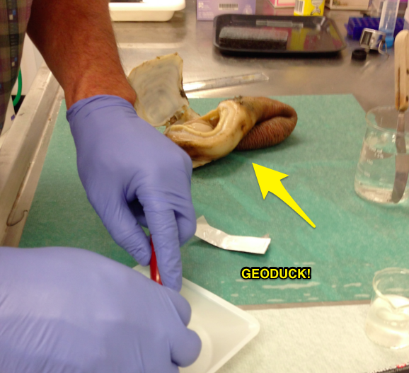

# My Favorite Gene
## DNMT

This page was created by Steven Roberts - [@sr320](https://github.com/sr320)

**Is it in the Geoduck transcriptome?**

---

The first thing I did was get a sequence from Genbank in a species with fully annotated genome.

[Here is a movie](http://owl.fish.washington.edu/btea/movies/Steven-serarches-for-DNMT.mov) of me doing just that! 

This is a screenshot of the NCBI page


---

This is a direct link to the page
<http://www.ncbi.nlm.nih.gov/nuccore/768001213>


##Blasting against Geoduck database




### Brent Dissecting Tissue used for making RNA-seq Libraries
<iframe width="560" height="315" src="https://www.youtube.com/embed/Acj3ta5UqR0?rel=0" frameborder="0" allowfullscreen></iframe>


my code :)

```
!blastn \
-query /Users/sr320/git-repos/course-btea/data/Hsapien_DNMT.fasta \
-db /Users/sr320/Desktop/big-data/db/Geo_Female \
-task blastn \
-outfmt 6 \
-out /Users/sr320/Desktop/big-data/DNMT_blastn_GeoFemale.out
```

When I run that I found a MATCH!!

Here is the top hit for GeoDuck Female

```
gi|768001213|ref|XM_011527774.1|	Geo_Pool_F_GGCTAC_L006_R1_001_val_1_(paired)_contig_23384	70.89	962	258	9	3846	4802	1744	800	1e-125	 452
```

Here is the top hit for GeoDuck Male

```
gi|768001213|ref|XM_011527774.1|	Geo_Pool_M_CTTGTA_L006_R1_001_val_1_(paired)_contig_7892	70.52	1472	394	14	3339	4802	2334	3773	0.0	 672
```


Here is the top hit for the Oly Male library

```
gi|768001213|ref|XM_011527774.1|	filtered_106A_Male_Mix_TAGCTT_L004_R1_(paired)_contig_9003	69.95	1764	476	15	3071	4801	2838	4580	0.0	 773
```


Here is the top hit for the Oly Female library

```
gi|768001213|ref|XM_011527774.1|	filtered_108A_Female_Mix_GGCTAC_L004_R1_(paired)_contig_8192	70.01	1764	475	15	3071	4801	2775	4517	0.0	 778
```


